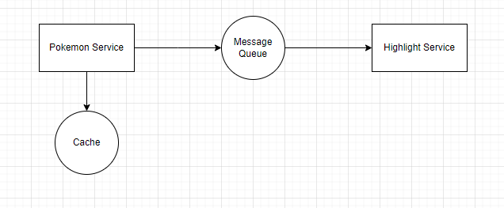

# Pokemon API
Challenge based on the instructions from: [GitHub Repository Link](https://github.com/looqbox/looqbox-backend-challenge)

## Technologies Used:
- Java 11
- Spring Boot
- Swagger
- JUnit
- Docker
- RabbitMQ

## How to Run:
1. Clone this repository.
2. Run the command `.gradlew.bat clean build` (Windows) within the root folder of both microservices. Then, use `docker-compose up -d`(with docker daemon initialized) in the main folder to start the containers.
3. Access the API's Swagger documentation at http://localhost:8080/swagger-ui/#/ and http://localhost:8081/swagger-ui/#/

## Endpoints:
- [http://localhost:8081/api/v1/pokemons/highlight](http://localhost:8081/api/v1/pokemons/highlight)
- [http://localhost:8080/api/v1/pokemons/](http://localhost:8080/api/v1/pokemons/)

## Big-Ω:
The algorithm used is quicksort, as explained in the PokemonService code comments. Quicksort's best-case time complexity is Ω(n log n), indicating that in the best-case scenario, the algorithm's efficiency cannot exceed n log n.

## Points for Improvement:
1. The implemented cache reduced request time by about 10 times, but it was implemented in a straightforward manner without considering its potential growth. In a more advanced scenario, estimating cache cleanup time and setting a size limit would be necessary.
2. For HighlightService to work, PokemonService must run first to enable Highlight to consume the queue. But because it was just a challenge, separating the application this way was a good way to create a microservice.
